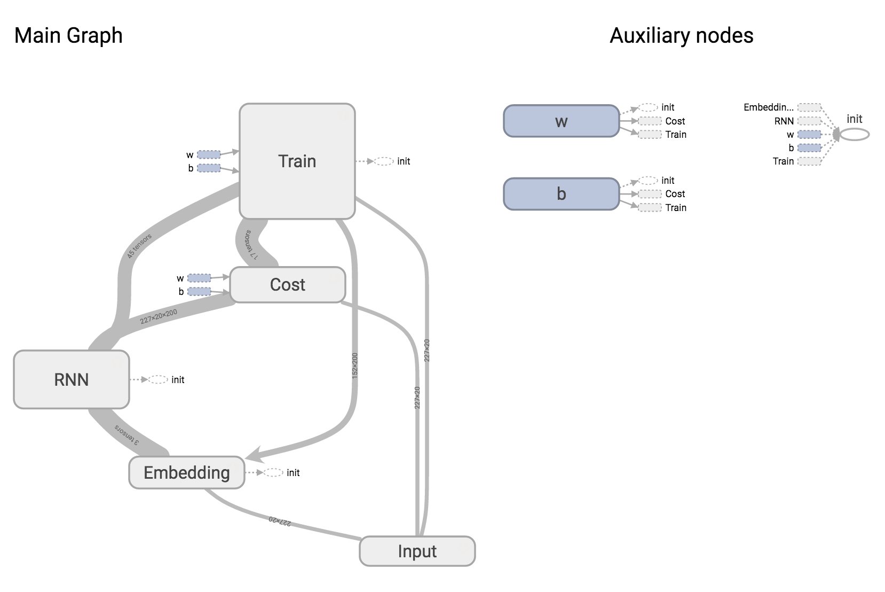

# TensorFlow RNN Language Model
This module is an example of how create a recursive neural network language model using [TensorFlow](https://www.tensorflow.org/).

## Usage

To train a model run

    tfrnnlm train text.txt model

This will use the text in `text.txt` to train an RNN language model that will be stored in the directory `model`.
See `tfrnnlm train --help` for the model parameters that you can set.
Various parameter sets are specified as text files in the `parameters` directory.
For example, to build a small model run

    tfrnnlm train text.txt model @parameters/small

## Model Structure
 
The model here is based on the Penn Treebank language model described in the [TensorFlow RNN tutorial](https://www.tensorflow.org/versions/master/tutorials/recurrent/index.html).

The text is tokenized on whitespace into words and converted into a sequence of indexes into a vocabulary.
Subsequences of these indexes are passed to the model as input and used to predict the following index.
Token indexes are embedded in a vector space the same size as the number of hidden layers in the RNN.
An RNN predicts a token given a sequence, and the average per-token cost is calculated using the cross-entropy loss.
Training runs for a specified number of epochs.
